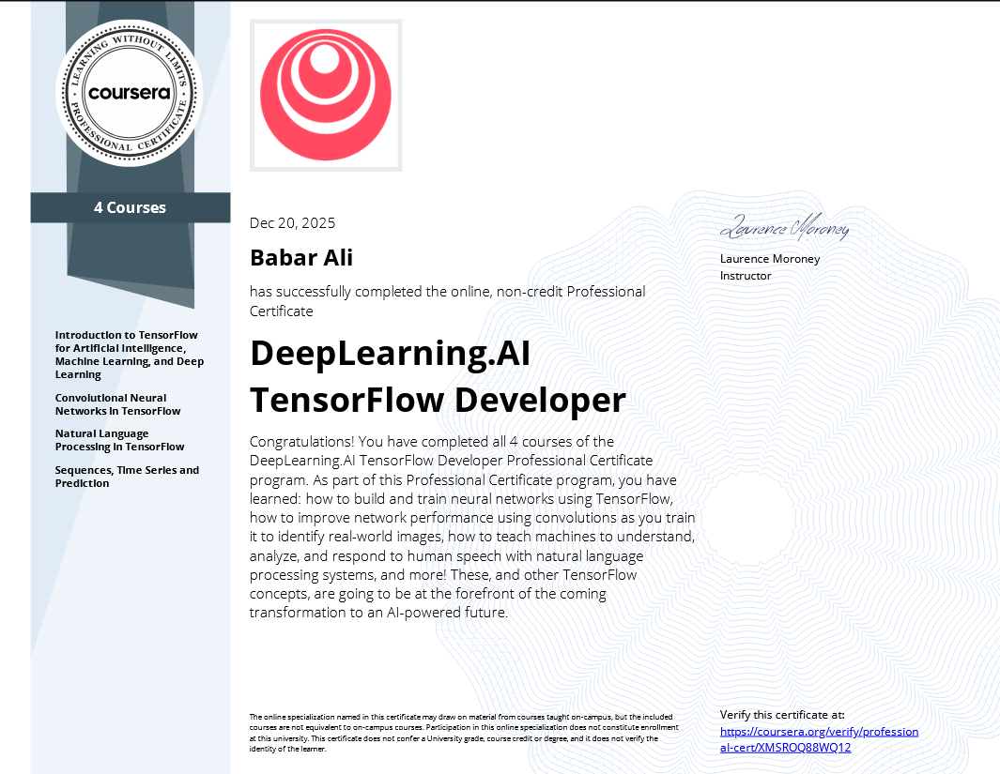

<p align="center">
  
</p>

## Certificate of Completion

<p align="center">
  
</p>
<p align="center">
  <b>Successfully Mastered TensorFlow, Computer Vision, NLP, and Time Series Forecasting!</b>
</p>

---
<p align="center">
  
  
  
  
  
</p>


## About This Repository

Welcome to my **TensorFlow Specialization** repository! 

This repository contains all my code, notes, and mini-projects from successfully completing the **DeepLearning.AI TensorFlow Developer Professional Certificate** on Coursera, taught by Laurence Moroney and Andrew Ng. 

---

<p align="center">
  
</p>

## Specialization Roadmap

This repository is structured around the 4 core courses of the specialization, all of which are now completed!

| Course | Focus Area | Key Concepts | Status |
| :--- | :--- | :--- | :---: |
| **Course 1** | **Introduction to TensorFlow** | Basic NNs, Callbacks, Computer Vision Basics | Completed |
| **Course 2** | **CNNs in TensorFlow** | Convolutions, Pooling, Data Augmentation, Transfer Learning | Completed |
| **Course 3** | **NLP in TensorFlow** | Tokenization, Word Embeddings, LSTMs, GRUs, Text Generation | Completed |
| **Course 4** | **Sequences, Time Series & Prediction** | Statistical Forecasting, RNNs for Time Series, Sunspot Prediction | Completed |

---

> **"AI is the new electricity."** – *Andrew Ng*
*Credit: All course materials, assignment specifications, and datasets are the intellectual property of DeepLearning.AI and Coursera.*


## Repository Structure

```text
DeepLearning.AI-TensorFlow-Specialization
├── Course_1_Intro_to_TensorFlow/
├── Course_2_CNNs_in_TensorFlow/
├── Course_3_NLP_in_TensorFlow/
├── Course_4_Sequences_Time_Series_and_Prediction/
├── resources
└── README.md
